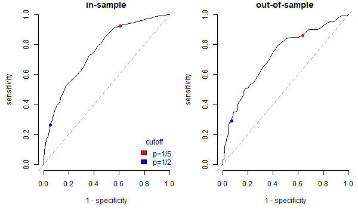

```{r setup, include=FALSE}
options(htmltools.dir.version = FALSE)

knitr::opts_chunk$set(eval = TRUE,
               echo = TRUE,
               warning = FALSE,
               message = FALSE,
               cache = FALSE)

htmltools::tagList(rmarkdown::html_dependency_font_awesome())
```

```{r plots_and_figures, include=FALSE}
library(ggplot2)
library(kableExtra)

theme_set(theme_gray(15))
```

```{r, references, echo=FALSE, cache=FALSE}
library(RefManageR)
BibOptions(check.entries = FALSE, 
           bib.style = "numeric", 
           cite.style = "authoryear", 
           style = "markdown",
           hyperlink = FALSE, 
           dashed = FALSE)
bib <- ReadBib("../refs/references.bib", check = FALSE)
```


class: title-slide-section-gray

# Classification

Our discussion draws heavily on Chapter 4 of `r Citet(bib, "Taddy19")`. 

---

# Classification

Many prediction tasks are about classification. Might want to classify

  * Ideology of a CEO as being left (-1), center (0), or right (1)
  * Personality of an employee according to big 5 traits
    + extraversion (also often spelled extroversion), 
    + agreeableness, 
    + openness, 
    + conscientiousness, 
    + neuroticism.
  * Hiring committees (or HR personnel) as being discriminatory (=1 or 0 if not) towards minorities, women, or any other historically disadvantaged group.   

These kinds of classification exercises fit well with our regression framework. The important distinction here is that $y$ can take on any discrete values between $\{1, 2, ..., m\}$. Prediction question here is: what is our best guess for $y$ given that we observe a new $\mathbf{x}$?

---

# K Nearest Neighbours (KNN) Algorithm

```{r, echo=FALSE, out.width = "35%", fig.align='center'}

knitr::include_graphics("figs/K_NN_Illustration.png")

```

Black dot is unknown. Can be white (y=1) or red (y=0). Would classify black dot as white on basis of 3 nearest neighbours. Alternatively, could say probability of being white is 2/3. 

---


# KNN Algorithm

Suppose: 

  * you have a labelled input vector $\mathbf{x}_1, \mathbf{x}_2, ..., \mathbf{x}_n$. This means that you know the value of $y_1$ for $\mathbf{x}_1$, the value of $y_2$ for $\mathbf{x}_2$, and so on and so forth. 
  * you have an unlabelled input vector $\mathbf{x}_f$. Here you do not know $y_f$.

K Nearest Neighbours Algorithm let you use the labelled input vector and labels to predict the label or class of $\mathbf{x}_f$. 

ALGORITHM 11 (K Nearest Neighbours Algorithm).  

  1. Compute $d(\mathbf{x}_i,\mathbf{x}_f)= \sqrt{\sum_{j=1}^p (x_{ij} - x_{fj})^2}$. 
  2. Take the $K$ nearest observations with labels: 
  $[\mathbf{x}_{i1},y_{i1}]...[\mathbf{x}_{iK},y_{iK}]$. 
  3. Predicted class for $\mathbf{x}_f$ is the most common label or class in this set: 
  $y_f = mode\{y_{i1},...,y_{iK}\}$.

"mode" picks the $y$ that would get the most votes (plurality rule). 

---


# KNN Example

.pull-left[

```{r}
library(MASS)
data(fgl)
dim(fgl)
head(fgl, n = 2)
```
]

.pull-right[

n = 214 observations. p = 9 inputs. Each observation describes a shard of glass.
  * RI = refractiveness index 
  * Na, Mg, Al, Si, K, Ca, Ba, and Fe tell us chemical composition by weight of oxide in percentage terms.
  * Type is the type of glass
    + WinF: Float glass window
    + WinNF: Nonfloat glass window
    + Veh: Vehicle window
    + Con: Container (bottles)
    + Tabl: Tableware
    + Head: Vehicle headlamp

Want to classify glass shards on the basis of RI, Na, Mg, Al, Si, K, Ca, Ba, Fe, and the K NN Algorithm. 
]
  
---

# KNN Example

```{r, echo=FALSE}
par(mfrow=c(2,3))
plot(RI ~ type, data=fgl, col=c(grey(.2),2:6), las=2)
plot(Al ~ type, data=fgl, col=c(grey(.2),2:6), las=2)
plot(Na ~ type, data=fgl, col=c(grey(.2),2:6), las=2)
plot(Mg ~ type, data=fgl, col=c(grey(.2),2:6), las=2)
plot(Ba ~ type, data=fgl, col=c(grey(.2),2:6), las=2)
plot(Si ~ type, data=fgl, col=c(grey(.2),2:6), las=2)
```
  
---

# KNN Example

Scale explanatory variables before measuring distances 

```{r}
#fgl data in R
x <- scale(fgl[,1:9]) # select column 1-9, column 10 is class label(target), scale converts to mean 0 sd 1
apply(x,2,sd) # apply function sd to columns of x, 2 is for column wise
```

---

# KNN Example

Scale explanatory variables before measuring distances 

```{r}
library(class) #has knn function 
test <- sample(1:214,10) #draw a random sample of 10 rows 
nearest1 <- knn(train=x[-test,], test=x[test,], cl=fgl$type[-test], k=1)
nearest5 <- knn(train=x[-test,], test=x[test,], cl=fgl$type[-test], k=5)
data.frame(fgl$type[test],nearest1,nearest5)
```

Accuracy is measured by the percent of matches between Column 1 and Column 2. In the case of NN5, it would be measured by the percent of matches between Col 1 and Col 3. Results will change each time you run this algorithm. 

---

# KNN good for intuition but not practice


  * computationally intensive. Inappropriate for big data settings. 

  * unstable with respect to K:

.pull-left[

$K = 1 \Rightarrow \hat{p}_f(white) = 0$

$K = 2 \Rightarrow \hat{p}_f(white) = 1/2$

$K = 3 \Rightarrow \hat{p}_f(white) = 2/3$

$K = 4 \Rightarrow \hat{p}_f(white) = 1/2$

]

.pull-right[

```{r, echo=FALSE, out.width = "75%", fig.align='center'}
knitr::include_graphics("figs/K_NN_Illustration.png")
```
 
  ]
  

---

# Probability, Cost, and Classification

In KNN there is no cost to misclassification. A misclassification cost can facilitate a computationally feasible and more stable algorithm. 

To understand why, suppose $y\in\{0,1\}$. Misclassification arise when 
  * predicted value $\hat{y}$ is 1 when true value $y$ is 0 (false positive)
  * predicted value $\hat{y}$ is 0 when true value $y$ is 1 (false negative)
e.g. doctors can over-prescribe a treatment (false positive) to a patient or tell the patient that they don't have cancer when they do (false negative). 

We want to attach costs to these types of errors. We then want to account for these errors in our classification algorithm. 

---

# Expected loss

We use expected loss to measure and incorporate costs into our classifications. 

Expected loss is defined as 

\begin{align*}
\mathbb{E}[loss(a)] = p_0 c(a,0) + p_1 c(a,1)
\end{align*}

where 
  * $a$ is the chosen class or label. 
  * $p_0$ and $p_1$ are the probabilities that the truth is 0 or 1, respectively. 
  * $c(a,0)$ is the cost of assigning $a$ when the truth is $0$. $c(a,1)$ is cost when the truth is $1$. 

To incorporate expected loss into our decision making, we need estimates of the probabilities $p_0$ and $p_1$. 

Given these probabilities, we would then pick the classification that yields the lowest expected loss. 

---

# Classification Example 

```{r, echo=FALSE}
#### ******* German Credit Data ******* ####
#Re-labeling and re-ordering categorical variables to make them more interpretable.
#Creating a new binary variable (rent) based on an existing feature (housing).
#Subsetting the dataset to retain only the relevant columns for further analysis.
credit <- read.csv("../Data/credit.csv")
## re-level the credit history and checking account status
credit$history = factor(credit$history, levels=c("A30","A31","A32","A33","A34"))
levels(credit$history) = c("good","good","poor","poor","terrible")
## a few others
credit$foreign <- factor(credit$foreign, levels=c("A201","A202"), labels=c("foreign","german"))
credit$rent <- factor(credit$housing=="A151")
credit$purpose <- factor(credit$purpose, levels=c("A40","A41","A42","A43","A44","A45","A46","A47","A48","A49","A410"))
levels(credit$purpose) <- c("newcar","usedcar",rep("goods/repair",4),"edu",NA,"edu","biz","biz")

credit <- credit[,c("Default", "duration", "amount",
                    "installment", "age", "history",
                    "purpose", "foreign", "rent")]

```

```{r}
head(credit)
dim(credit)
```

---

# Classification Example 

```{r}
library(gamlr)
source("C:/Users/micap/Documents/GitHub/data-science/data/naref.R")
credx <- sparse.model.matrix(Default ~ . ^ 2, data=naref(credit)); colnames(credx) #create sparsemo
#takes all variables and crosses them
#The ^2 indicates that the model matrix should include not only the main effects of the predictors but also their pairwise interaction terms.
```

---

.pull-left[

```{r}
default <- credit$Default #creating dummy
credscore <- cv.gamlr(credx, default, family="binomial") #CV excercise
```

]

.pull-right[

```{r}
par(mfrow=c(1,2))
plot(credscore$gamlr)
plot(credscore)
```

]

---

# Classification Example 

```{r}
sum(coef(credscore, s="min")!=0) # min
sum(coef(credscore$gamlr)!=0) # construct AICc (adjusted)
sum(coef(credscore$gamlr, s=which.min(AIC(credscore$gamlr)))!=0) # AIC(regular) you compare different models
# the OOS R^2. not good if so small.
1 - credscore$cvm[credscore$seg.min]/credscore$cvm[1]
```

---

```{r}
## What are the underlying default probabilities
## In sample probability estimates
pred <- predict(credscore$gamlr, credx, type="response")
pred <- drop(pred) # remove the sparse Matrix formatting
boxplot(pred ~ default, xlab="default", ylab="prob of default", col=c("maroon","darkgreen"))
```

---

A **classification rule** would be to 

  * predict $\hat{y}_f=0$ if $p_f\leq p$.   
  * predict $\hat{y}_f=1$ if $p_f > p$.   

This type of classification rule leads to false positives and false negatives. Decisions should reflect their probabilities

|             | Signal=1 | Signal=0| Signal Total|
|-------------|----------|---------|-------------|
| Label=1     | $TP$     | $FP$    | $m_1$       |
| Label=0     | $FN$     | $TN$    | $m_0$       |
| Label Total | $n_1$    | $n_0$   | $N$         |


where Signal=0 means noise. Can define **False Positive Rate** (probability of type I error) as 
\begin{align*}
FPR = \frac{FP}{FP + TN} = \frac{FP}{n_0} = 1 - \text{specificity}
\end{align*}

where *specificity* is defined below. Can also define **False Negative Rate** (probability of type II error) as 

\begin{align*}
FNR = \frac{FN}{FN + TP} = \frac{FN}{n_1} = 1 - \text{sensitivity}
\end{align*}

where *sensitivity* is defined below. Boxplots on last slide suggest this is a hard classification problem. Quite some overlap between true nondefaults and true defaults. 

---

# Classification Rule 

```{r}
#p, you decide the value
rule <- 2/3 # move this around to see how these change
sum( (pred>rule)[default==0] )/sum(pred>rule) ## false positive rate at 1/5 rule group that didnt default
sum( (pred<rule)[default==1] )/sum(pred<rule) ## false negative rate at 1/5 rule
```
False positive rate is high because we put more weight on defaults. We treat defaults as being more costly than the alternative. 

---

# Sensitivity and specificity 

Other common summaries for classification errors are the **True Positive Rate** (TPR) and the **True Negative Rate** ** (TNR). 

.pull-left[

TPR defined as 

\begin{align*}
TPR = \frac{TP}{FN + TP} = \frac{TP}{n_1} = \text{sensitivity}
\end{align*}

```{r}
sum( (pred>rule)[default==1] )/sum(default==1) ## sensitivity
```

]

.pull-right[

TNR defined as 

\begin{align*}
TNR = \frac{TN}{FP + TN} = \frac{TN}{n_0} = \text{specificity}
\end{align*}

```{r}
sum( (pred<rule)[default==0] )/sum(default==0) ## specificity
```

]

As before, this reflects the additional costs attached to defaults. The ratio defines: 

\begin{align*}
ROC = \frac{TPR}{TNR}
\end{align*}

Can compute $ROC$ at different classifications thresholds. $ROC$ plots show the (out-of-sample preferably) performance of classification models. 

---

## OOS ROC curve

```{r, echo=FALSE}
# refit the model using only 1/2 of data and predict probabilities
test <- sample.int(1000,500) #creates indices for the data
credhalf <- gamlr(credx[-test,], default[-test], family="binomial")
predoos <- predict(credhalf, credx[test,], type="response")
defaultoos <- default[test]
```

```{r, echo=FALSE}
source("C:/Users/micap/Documents/GitHub/data-science/data/roc.R")
png(file="ROCCurve.png", width=600, height=350)
par(mai=c(.9,.9,.2,.1), mfrow=c(1,2))
roc(p=pred, y=default, bty="n", main="in-sample")
## our 1/5 rule cutoff
points(x= 1-mean((pred<.2)[default==0]), 
	y=mean((pred>.2)[default==1]), 
	cex=1.5, pch=20, col='red') 
## a standard `max prob' (p=.5) rule
points(x= 1-mean((pred<.5)[default==0]), 
	y=mean((pred>.5)[default==1]), 
	cex=1.5, pch=20, col='blue') 
legend("bottomright",fill=c("red","blue"),
	legend=c("p=1/5","p=1/2"),bty="n",title="cutoff")
roc(p=predoos, y=defaultoos, bty="n", main="out-of-sample")
## our 1/5 rule cutoff
points(x= 1-mean((predoos<.2)[defaultoos==0]), 
	y=mean((predoos>.2)[defaultoos==1]), 
	cex=1.5, pch=20, col='red') 
## a standard `max prob' (p=.5) rule
points(x= 1-mean((predoos<.5)[defaultoos==0]), 
	y=mean((predoos>.5)[defaultoos==1]), 
	cex=1.5, pch=20, col='blue') 
dev.off()
```

```{r, echo=FALSE, out.width = "80%", fig.align='center'}



```

---

.pull-left[

Now we can integrate these potential errors into our loss function for loans. Should we then use this algorithm to hand out loans? 

Plot on the left shows default outcomes as a function credit history. If you used this data and model to hand out loans, then you might hand out more loans to people with a terrible credit history. Not clear that this is good idea. 

Highlights an important point. Classification based on causal models may be a good starting point for robot loans (though difficult). 
    
]

.pull-right[

```{r}
par(mai=c(.8,.8,.1,.1))
plot(factor(Default) ~ history, data=credit, col=c(8,2), ylab="Default") 
```

]

---

# Multinomial Logistic Regression

Focus so far on binary classification: $K=2$ categories. What to do if you have $K>2$ categories? Can model $K$ classes much like a binary variable. Let 
\begin{align*}
\mathbf{y}_i = (y_{i1},y_{i2},\ldots,y_{ik},\ldots,y_{i1}) = (0,0,\ldots,1,\ldots,0)
\end{align*}
where the $k^{th}$ entry $y_{ik}=1$ means that we have observed class $k$ for person (or unit) $i$. The conditional probability for class $k$ is then 
\begin{align*}
\mathbb{E}[y_{ik} |\mathbf{x}_i] = \mathbb{P}(y_{ik}=1 |\mathbf{x}_i) = f( \mathbf{x}_i'\boldsymbol{\beta}_k ).
\end{align*}
Thus need to fit one set of regression coefficients $\boldsymbol{\beta}_k$ for each class. How do we do this? Multinomial logit 
\begin{align*}
\mathbb{P}(y_1 = 1|\mathbf{x}_i) = p_1(\mathbf{x}_i) = \frac{e^{\mathbf{x}_i'\boldsymbol{\beta_1}}}{
e^{\mathbf{x}_i'{\boldsymbol{\beta_1}}} + e^{\mathbf{x}_i'{\boldsymbol{\beta_2}}} + \cdots + e^{\mathbf{x}_i'{\boldsymbol{\beta_K}}}}
\end{align*}
for class 1, 
\begin{align*}
\mathbb{P}(y_2 = 1|\mathbf{x}_i) = p_2(\mathbf{x}_i) = \frac{e^{\mathbf{x}_i'\boldsymbol{\beta_2}}}{
e^{\mathbf{x}_i'{\boldsymbol{\beta_1}}} + e^{\mathbf{x}_i'{\boldsymbol{\beta_2}}} + \cdots + e^{\mathbf{x}_i'{\boldsymbol{\beta_K}}}}
\end{align*}
for class 2, and so on. Ultimately can define likelihood: $\prod_{i}^n p_1(\mathbf{x}_i)^{y_{i1}}p_2(\mathbf{x}_i)^{y_{i2}}\cdots p_K(\mathbf{x}_i)^{y_{iK}}$. Can estimate this object.


---

# Multinomial Logistic Regression

Taking logs of the likelihood and then multiplying by $-2$ gives the multinomial deviance  
\begin{align*}
dev(\boldsymbol{\beta_1},\ldots,\boldsymbol{\beta_K}) =-2 \sum_{i=1}^n \sum_{k=1}^K y_{ik}ln(p_k(\mathbf{x}_i))
\end{align*}
where 
\begin{align*}
ln(p_k(\mathbf{x}_i)) = \mathbf{x}_i'\boldsymbol{\beta_k} - ln(e^{\mathbf{x}_i'{\boldsymbol{\beta_1}}} + e^{\mathbf{x}_i'{\boldsymbol{\beta_2}}} + \cdots + e^{\mathbf{x}_i'{\boldsymbol{\beta_K}}})
\end{align*}
Can then estimate multinomial logistic regressions through penalized deviance minimization, where we would choose $(\boldsymbol{\beta_1},\ldots,\boldsymbol{\beta_K})$ to minimize 
\begin{align*}
-\frac{2}{n}\sum_{i=1}^n \sum_{k=1}^K y_{ik}ln(p_k(\mathbf{x}_i)) + \sum_{k=1}^K \sum_{p=1}^P \lambda |\beta_{kj}|
\end{align*}
Can let $\lambda_k$ vary by class but we don't do that here. 


---

# LASSO penalized multinomial regression example 

```{r}
#it also tells us non zero coefficients and the mean adjusted for SE
library(glmnet)
xfgl <- sparse.model.matrix(type~.*RI, data=fgl)[,-1] #Design matrix includes chemical composition variables and all their interactions with refractive index (RI).
gtype <- fgl$type
glassfit <- cv.glmnet(xfgl, gtype, family="multinomial") #cross validation experiments
glassfit
```


---

.pull-left[

```{r}
plot(glassfit)
```

Out of sample deviance across CV folds for multinomial logistic regression on glass shard data. 
]

.pull-right[
```{r}
#different responses
par(mfrow=c(2,3), mai=c(.6,.6,.4,.4)) #2x3 grid and adjusting margin plots
plot(glassfit$glm, xvar="lambda")
```

Regularization paths for glmnet multinomial logistic lasso regression.
]


---

```{r}
B  <- coef(glassfit, select="min"); B ## extract coefficients, we take min no SE adjusted
B <- do.call(cbind, B) 
colnames(B) <- levels(gtype) # column names dropped in previous command. This command adds them back.
```

---

#Interpreting multinomial logit coefficients

.pull-left[

Recall log odds interpretation of slope coefficients $\beta_1,\dots,\beta_p$ in a binary logistic regression. Coefficients measure linear effects of covariates on log odds: 

$ln(\frac{p}{1-p}) = \beta_0 + \beta_1 x_1 + \cdots + \beta_p x_p$
  
In case of multinomial logistic regression, log odds interpretation applies to the coefficient difference between any two classes $a$ and $b$

$ln(\frac{p_a}{p_b}) = ln(\frac{exp(\mathbf{x}'\boldsymbol\beta_a)}{exp(\mathbf{x}'\boldsymbol\beta_b)}) = = \Delta\beta_0 + \Delta\beta_1 x_1 + \cdots + \Delta\beta_p x_p$

where $\Delta\beta_k = \beta_{ka} - \beta_{kb}$ is difference between the slope coefficient $\beta_k$ across classes $a$ and $b$. Exponentiating both sides reveals that $exp(\Delta\beta_1)$ measures the multiplicative effect of a 1 unit increase in $x_1$ on the odds of $a$ relative to $b$.
]

.pull-right[

```{r}

DeltaBMg <- B["Mg", "WinNF"] - B["Mg", "WinF"]; DeltaBMg; #B is a matrix. Fixed Row. Vary Columns. k is Mg, a is WinNF, b is WinF. 
exp(DeltaBMg);
1 - exp(DeltaBMg) #how odds of one option change relative to other option
```
1 unit increase in Mg decreases odds of nonfloat glass over float glass by 0.36. A similar set of calculations shows that, by contrast, a 1 unit increase in Mg increases odds of nonfloat glass over container glass by 0.66. 

Do these estimates make sense in light of slide 7? 

]

---

#Interpreting multinomial logit coefficients

You might be interested in learning how a covariate changes the odds of one class relative to all other classes. A comparison of 1 class to another yields a nice formulation 

$ln(\frac{p_a}{p_b}) = ln(\frac{exp(\mathbf{x}'\boldsymbol\beta_a)}{exp(\mathbf{x}'\boldsymbol\beta_b)}) = = \Delta\beta_0 + \Delta\beta_1 x_1 + \cdots + \Delta\beta_p x_p$

because log and exponential functions can cancel out in the numerator and denominator. A comparison of 1 class to all other classes does not yield such a nice formulation: 

$ln(\frac{p_k}{1 - p_k}) = ln(\frac{p_k}{\sum_{j\neq k} p_j}) = \beta_{0k} + \beta_{1k} x_1 + \cdots + \beta_{pk} x_p - ln\Big(\sum_{j\neq k} exp(\beta_{0j} + \beta_{1j} x_1 + \cdots + \beta_{pj} x_p)\Big)$

Thus, if you want to learn about the effect of a particular covariate on $ln(\frac{p_k}{1 - p_k})$, you would compute the log odds at two values of the covariate, and then compare. 

---

```{r}
probfgl <- predict(glassfit, xfgl, type="response"); dim(probfgl); head(probfgl,n=2); tail(probfgl,n=2)
#gives in-sample probabilities. Note: this is nXKX1 array. Need nXK array. To convert: 
probfgl <- drop(probfgl); #use dim(probfgl) to check dim is 214 by 6
n <- nrow(xfgl)
trueclassprobs <- probfgl[cbind(1:n, gtype)]; head(trueclassprobs,n=3); tail(trueclassprobs,n=3) #we extract the column of win f (3)
#for each obs there is one probability that corresponds to realized shard for that obs. Last command extracts those probabilities. 
#Note use of a matrix to index a matrix.
```

---

.pull-left[

```{r}
#in good data info is disntinct from others to let us predict 
plot(trueclassprobs ~ gtype, col="lavender", varwidth=TRUE,
	xlab="glass type", ylab="prob( true class )") 
```

varwidth=TRUE makes box widths proportional to response proportion.

]

.pull-right[

Plots probabilities for true class. Figure tells us about in-sample probability fit for each class. Boxes closer to 1 are a tighter fit. 

Tight fit for headglass. Makes sense. High Barium content is unique to headglass (see figure on Slide 7). 

Contrast this with Veh, Con, Tabl. No one chemical is unique to these shard types. Accordingly, the fits are not tight. But fits may also reflect fact that response proportion is low for these shard types. 


]

---
# Distribution and Big Data 

Multinomial regression is slow. 

Taddy discusses an alternative called distributed multinomial regression. Under this alternative, 

  * distribute multinomial regression across several processors or machines. 
  
  * do this by estimating a Poisson distribution for each class of the dependent  variable. 
  
This is a type of parallel programming. We will not cover distributed multinomial regression here. Instead we will talk broadly about the nature of parallel programming.  

---
# Distribution and Big Data 

What is a parallel algorithm? An algorithm where multiple computations are being done at the same time. 

There are different types of parallel programming: 

  * Each processor or machine needs to see the full data. 
  
  * Each processor or machine can see a subset of the full data. 
  
Latter is especially advantageous for truly big data.   
  
---
# Distribution and Big Data 

Idea behind big data storage: 

  * break your data into lots of small pieces 
  
  * store those pieces on several different machines 
  
  * leverage high bandwidth communication to let those machines talk to each other during any analysis
  
  * End user doesn't hold the data on their own machine. Only works with a map of where things are.  

Lots of examples with this type of storage: 

  * Amazon S3
  
  * Microsoft Azure Blob Storage
  
  * Surfsara here in the Netherlands

---
# Distribution and Big Data 

How do you do statistics on data that is split over many machines? Researchers at Google developed a recipe called MapReduce (MR). It makes use of the fact that the data is stored locally and tries to minimize overhead costs relating to communication. 

This recipe requires you to specify a key that indexes observations by subgroups. 

.pull-left[

ALGORITHM 12 (MapReduce Framework). Given a key, you proceed as follows  

  1. map: Apply the "map" to the local data. Output is written to temporary storage. 
  
  2. shuffle: redistribute data such that all data belonging to one key is located on one machine. 
  
  3. reduce: process each group of data locally, in parallel, i.e. at the same time. 

]

.pull-right[

EXAMPLE. Suppose that you are trying to extract dates and counts from a large database of newspaper articles. 

  1. map: the "map" here would be a function that extracts the data and counts for each word. 
    + e.g. 2017/06/04|tacos 5 says that the word tacos appeared 5 times on this date.
    + 2017/06/04|tacos becomes the key in this example
    
  2. shuffle: put all instances for the same key on the same machine
    + all counts of tacos on 2017/06/04 are placed on the same machine
    
  3. reduce: add up the counts for each key 
    + total up tacos on 2017/06/04 
  


]

---

# References

```{r, 'refs1', results='asis', echo=FALSE, eval=TRUE}
PrintBibliography(bib, start = 1, end = 6)
```
